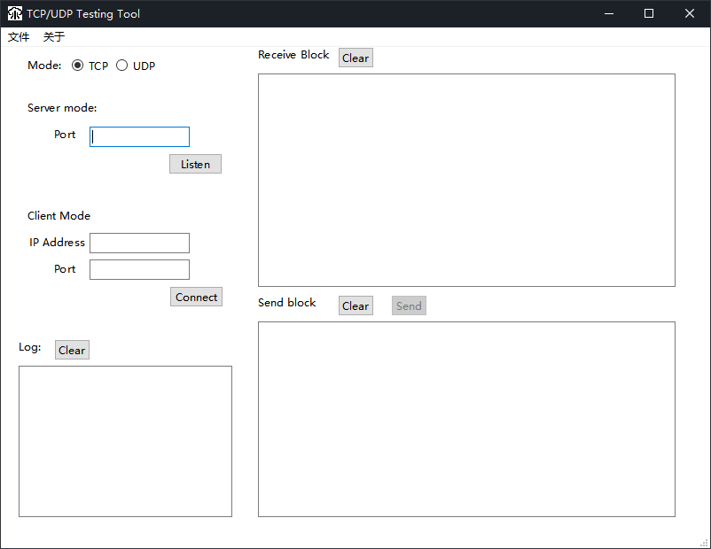

一款简单高效的网络传输测试工具，支持在TCP和UDP协议下，以服务器或客户端的模式运行，监听端口，收发数据。

A simple and efficient network transmission test tool that supports running in server or client mode under TCP and UDP protocols, listening to ports, and receiving and sending data.

Environment：

QT: 6.4.0

